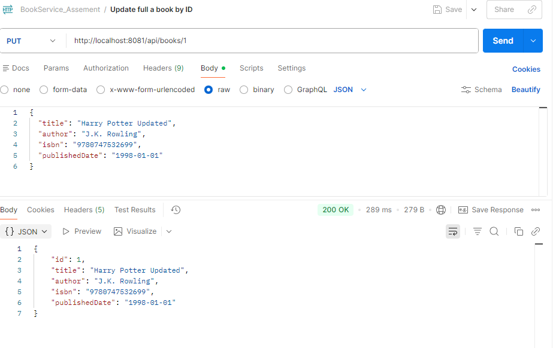
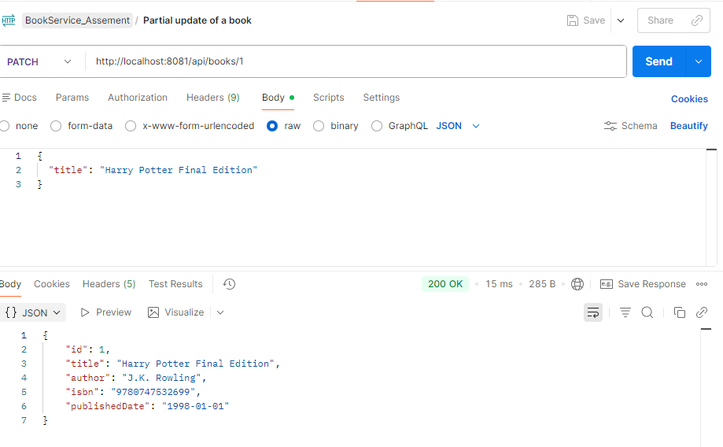
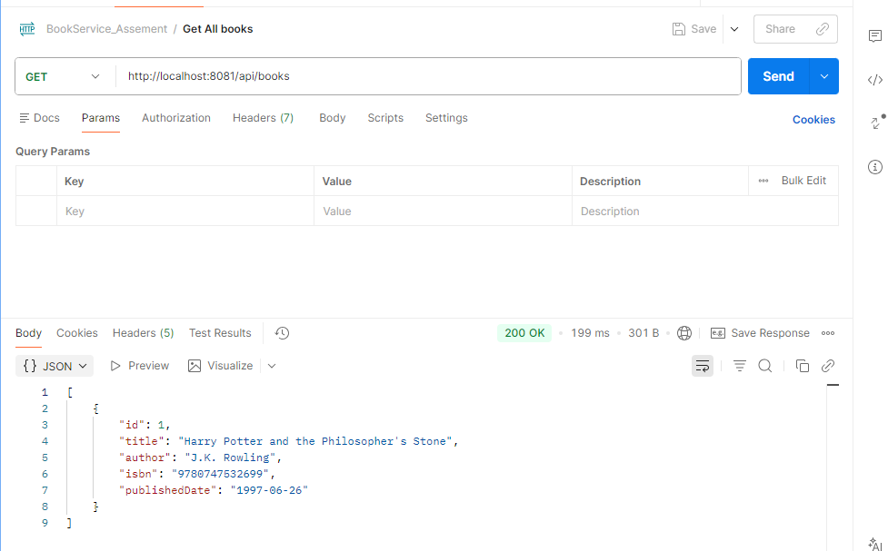
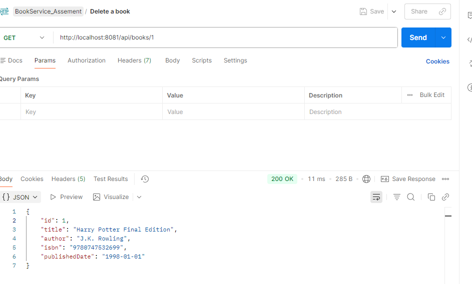
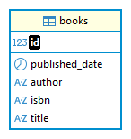

# Book Management Microservice

Aplikasi microservice sederhana menggunakan Spring Boot untuk melakukan operasi CRUD (Create, Read, Update, Delete) pada data buku.

---

## 🚀 Tech Stack

- Java 17
- Spring Boot (3.5.11)
- Maven
- PostgreSQL
- Spring Data JPA
- Postman (untuk pengujian API)
- Git (version control)

---

## 📦 Arsitektur Project

Project ini menggunakan arsitektur berlapis (layered architecture):

- **Controller** → Menangani HTTP request & response
- **Service** → Berisi business logic
- **Repository** → Akses data ke database
- **DTO** → Pemisahan request & response dari entity
- **Entity** → Representasi tabel database
- **Exception Handling** → Global error handling menggunakan `@ControllerAdvice`

---

## 🗄 Konfigurasi Database

Project ini menggunakan **PostgreSQL** sebagai database.

### Environment Variables yang Dibutuhkan

Sebelum menjalankan aplikasi, pastikan sudah mengatur system environment variable untuk password database berikut:
```
DB_Pw_Postgres=your_postgres_password
```

### Contoh application.properties

```properties
spring.datasource.url=jdbc:postgresql://localhost:5432/bookservice_db
spring.datasource.username=postgres
spring.datasource.password=${DB_Pw_Postgres}

spring.jpa.hibernate.ddl-auto=update
spring.jpa.show-sql=true
spring.jpa.properties.hibernate.format_sql=true
```

Pastikan:
- PostgreSQL sudah berjalan
- Database `bookservice_db` sudah dibuat

---

## ▶️ Cara Menjalankan Project

### 1️⃣ Clone Repository

```
git clone https://github.com/your-username/springboot-microservice-task-anisah.git
```

### 2️⃣ Masuk ke Folder Project

```
cd springboot-microservice-task-your-name
```

### 3️⃣ Build Project

```
mvn clean install
```

### 4️⃣ Jalankan Aplikasi

```
mvn spring-boot:run
```

Aplikasi akan berjalan di:

```
http://localhost:8081
```

---

## 📌 Endpoint API

Base URL:

```
http://localhost:8081/api/books
```

| Method | Endpoint | Deskripsi                |
|--------|----------|--------------------------|
| POST   | /api/books | Menambahkan buku baru    |
| GET    | /api/books | Mengambil seluruh data buku |
| GET    | /api/books/{id} | Mengambil buku berdasarkan ID |
| PUT    | /api/books/{id} | Update seluruh data buku |
| PATCH  | /api/books/{id} | Update sebagian data buku |
| DELETE | /api/books/{id} | Menghapus buku           |

---

## Contoh Request (Postman)

### POST - Tambah Buku

```json
{
  "title": "Harry Potter and the Philosopher's Stone",
  "author": "J.K. Rowling",
  "isbn": "9780747532699",
  "publishedDate": "1997-06-26"
}
```

### PUT - Update Full


```json
{
  "title": "Harry Potter Updated",
  "author": "J.K. Rowling",
  "isbn": "9780747532699",
  "publishedDate": "1998-01-01"
}
```

### PATCH - Update Sebagian

```json
{
  "title": "Harry Potter Final Edition"
}
```
## Dokumentasi Postman
### Get all book


### Get a book by ID


### Delete a book


---

## ⚠️ Penanganan Error (Exception Handling)

Project ini menggunakan:

- `ResourceNotFoundException`
- `GlobalExceptionHandler` dengan `@ControllerAdvice`

Setiap error akan dikembalikan dalam format response yang terstandarisasi.

---

##  ER Diagram


Entity utama dalam project ini adalah:

### Tabel: BOOK

| Field | Tipe Data | Keterangan |
|-------|--------|------------|
| id | BIGINT (PK) | Primary key |
| title | VARCHAR | Judul buku |
| author | VARCHAR | Penulis |
| isbn | VARCHAR | Nomor ISBN |
| published_date | DATE   | Tanggal terbit |


```

```

---

## 📌 Catatan

- Mengikuti prinsip RESTful API
- Menggunakan DTO untuk memisahkan entity dengan response API
- Menggunakan PostgreSQL sebagai database
- Menggunakan environment variable untuk keamanan kredensial